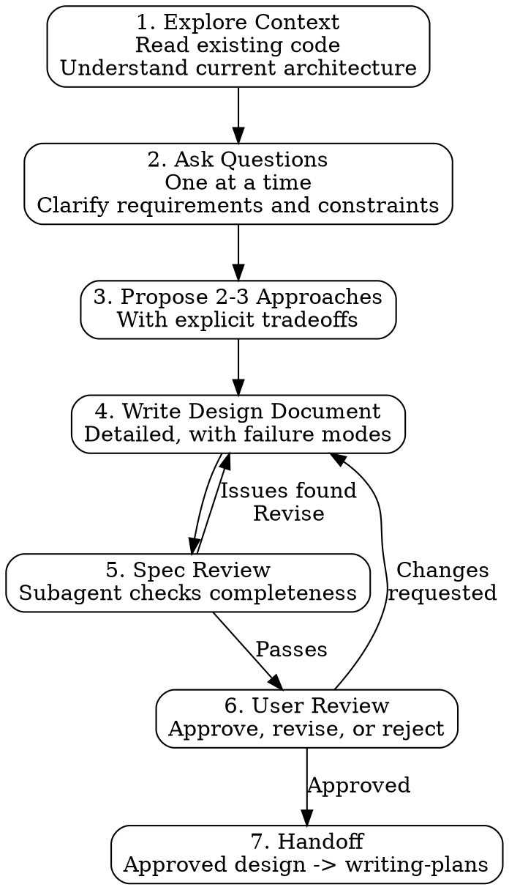

# Brainstorming

## Purpose

This skill enforces a design-first approach to all creative work on the trading bot. No code is written until the design is explored, documented, reviewed, and approved. This prevents the most expensive kind of bug: building the wrong thing, or building the right thing in a way that introduces silent failures in a live trading system.

## HARD GATE

**No implementation code is written until the design document is approved by the user.**

This is not optional. If you catch yourself writing implementation code without a reviewed design document, STOP immediately and return to this skill.

## When to Use This Skill

- Designing a new trading strategy.
- Adding a new feature to the bot (new order type, data source, indicator, risk rule).
- Modifying existing bot behavior (signal logic, execution flow, risk parameters).
- Building a new subsystem (monitoring, alerting, reporting, backtesting).
- Any work involving design decisions, not just implementing a clear, pre-existing spec.

## Process Flow



## Step-by-Step Process

### Step 1: Explore Context

Before asking any questions, understand the current state of the system:

- Read existing code that relates to the proposed work.
- Map the current architecture: data flow, order flow, state management.
- Identify what already exists that can be reused or extended.
- Note constraints: broker API limitations, data availability, latency requirements, capital constraints.
- Check for existing patterns that the new work should follow.

**Output**: A brief summary of current state, relevant code locations, and identified constraints.

### Step 2: Ask Questions

Ask clarifying questions **ONE AT A TIME**. Do not dump a list of 10 questions. Ask the most important question, wait for the answer, then ask the next most important question based on what you learned.

**Essential questions to cover:**

- What problem is this solving? (The "why" before the "what".)
- What does success look like? (Measurable acceptance criteria.)
- What are the constraints? (Time, capital, risk tolerance, API rate limits, data availability.)
- What should happen when things go wrong? (Failure modes -- this is critical for trading.)
- Is there an existing pattern in the codebase this should follow?
- What is the priority? (Must-have vs nice-to-have features.)
- What is the risk tolerance? (Maximum acceptable loss from this feature failing.)

**Output**: Documented answers to all clarifying questions.

### Step 3: Propose 2-3 Approaches

Present 2-3 meaningfully different approaches. Not minor variations -- genuinely different architectures or strategies.

For each approach, document:

| Aspect | Details |
|--------|---------|
| **Summary** | One-paragraph description |
| **Architecture** | How it integrates with the existing system |
| **Tradeoffs** | What you gain and what you sacrifice |
| **Complexity** | Estimated effort: low / medium / high |
| **Risk** | What could go wrong with this approach |
| **Trading Impact** | Effect on order flow, position tracking, risk management |

**Output**: Comparison table with clear recommendation and reasoning.

### Step 4: Write Design Document

Write a detailed design document for the chosen approach.

#### Design Document Template

```markdown
# Design: [Feature Name]

## Overview
[One paragraph: what this does and why it matters.]

## Requirements
- [Functional requirement 1]
- [Functional requirement 2]
- [Non-functional requirement: latency, reliability, etc.]

## Architecture
[How this fits into the existing system. Include diagram if the data/order flow is non-obvious.]

## Detailed Design
[Data structures, algorithms, interfaces, state machines. Be specific enough that implementation is mechanical.]

## Failure Modes Analysis
[REQUIRED. See Trading Domain Considerations below.]

## Testing Strategy
[Reference specific trading-tdd categories (1-10) that apply. List the key test scenarios.]

## Configuration
[New config values with types, defaults, validation rules, and documentation.]

## Migration / Rollback Plan
[How to deploy this change safely. How to undo it if problems arise in production.]

## Open Questions
[Anything unresolved that needs input before implementation.]
```

### Step 5: Spec Review

Use the spec document reviewer subagent (`spec-document-reviewer-prompt.md` in this skill folder) to review the design document. The reviewer checks for:

- Completeness (all template sections filled).
- Failure mode coverage (every component's failure path documented).
- Risk assessment (trading-specific risks identified).
- Testing strategy (appropriate trading-tdd categories referenced).
- Architecture alignment (fits existing patterns, no rogue order paths).

If the reviewer finds issues, return to Step 4 and address them before presenting to the user.

### Step 6: User Review

Present the complete design document to the user. The user may:

- **Approve**: Proceed to Step 7 (handoff to writing-plans).
- **Request changes**: Return to Step 4 with specific feedback.
- **Reject**: Return to Step 2 or Step 3 with new direction from the user.

The user's decision is final. Present your recommendation, but do not proceed without explicit approval.

### Step 7: Handoff to Writing Plans

Once the user approves, transition to the `writing-plans` skill to create a step-by-step implementation plan from the approved design document. The design document becomes the source of truth for the plan.

---

## Trading Domain Considerations

Every design document MUST address ALL of the following. These are NOT optional -- they are required sections. Omitting any one of them is a review failure.

### 1. Failure Modes Analysis

For every new component or modification, answer these questions:

- What happens if this component **throws an exception**?
- What happens if this component **returns None/null/empty**?
- What happens if this component **is slow** (> 1 second response time)?
- What happens if this component **is unreachable** (network failure, service down)?
- What happens if this component **returns stale data**?

**For each failure mode, the answer MUST be one of:**
- "The system rejects the operation and alerts the operator." (GOOD)
- "The system halts trading and alerts the operator." (GOOD)
- "The system continues with incorrect state." (UNACCEPTABLE -- redesign required)
- "The system crashes." (UNACCEPTABLE -- add error handling)

### 2. New Order Entry Path Check

If this feature introduces ANY new code path that can submit an order:

- [ ] Does it go through the **unified dedup gate**? (If not, duplicate orders are possible.)
- [ ] Does it go through the **risk manager**? (If not, risk limits can be bypassed.)
- [ ] Does it respect the **kill switch**? (If not, orders can be placed during halt.)
- [ ] Is the order path **identical** to existing order paths? (Same validation, same logging, same dedup.)

**Rule**: There MUST be ONE order entry path through the system. Every feature uses it. No shortcuts, no "fast paths," no "just this once" bypasses.

### 3. Position State Impact

If this feature affects position tracking in any way:

- Can it cause a **local/broker position mismatch**?
- Does it correctly handle **partial fills**?
- Does it interact with **reconciliation** (could it cause false positives or false negatives)?
- Does it interact with **options grace period** tracking?
- Could it create a state where position quantity is negative unexpectedly?

### 4. Fail-Closed Verification

For every new decision point (risk check, validation, signal evaluation):

- If the code throws an exception, does it **REJECT** the operation?
- If the code returns None, is that treated as **REJECT**?
- Is there a test (Category 5 from trading-tdd) that verifies the fail-closed behavior?

**Rule**: Every exception in a decision path results in REJECT. Never None. Never silent pass-through. Never "assume safe."

### 5. Backtest Requirement

If this feature changes strategy logic or signal generation:

- Does the backtest framework support this change?
- Can you run a backtest before deploying to paper or live?
- Is the strategy code **identical** between backtest and live execution?
- Do existing backtest results need to be re-run and re-validated?

### 6. Config Single Source

If this feature introduces new configuration values:

- [ ] Are they in the **single config file** (not hardcoded in source)?
- [ ] Do they have **validation at startup** (type checking, range checking)?
- [ ] Do they have **reasonable defaults**?
- [ ] Are they **documented** (what the value means, valid range, units)?

---

## Key Principles

1. **Design before code.** The cost of redesigning is 10x the cost of designing correctly the first time. In trading, the cost of a design flaw can be measured in dollars lost.

2. **One question at a time.** Dumping a list of questions overwhelms the user and produces shallow, incomplete answers. Ask, listen, then ask the next question informed by the answer.

3. **Explicit tradeoffs.** Every approach has costs. Name them. "This approach is simpler but adds 50ms latency." "This approach handles partial fills but requires a state machine."

4. **Failure modes are first-class citizens.** In trading systems, the failure mode analysis is MORE IMPORTANT than the happy-path design. The happy path makes money; the failure paths lose money.

5. **The user decides.** Present options and your recommendation with clear reasoning, but the user makes the final call. Do not proceed without explicit approval.

6. **Document for your future self.** The design document is not just for review -- it is the permanent reference during implementation and future maintenance.

---

## Red Flags -- Stop and Reconsider

- **Jumping to code without design**: STOP. Return to this skill. No exceptions.
- **Design document with no failure modes section**: Incomplete. The failure modes section is the most important part for trading systems.
- **"It will just work"**: Nothing "just works" in trading. Enumerate every failure path.
- **Single approach presented**: Present 2-3 alternatives. If only one approach exists, explicitly state why alternatives were rejected.
- **No testing strategy in design**: If you cannot describe how to test it, you do not understand it well enough to build it.
- **New order path that bypasses dedup or risk manager**: REJECT the design. There is ONE order path.
- **Hardcoded values in the design**: All tunable values go in config with validation.
- **"We can add tests later"**: No. Tests are designed now, written first (trading-tdd), and are part of the implementation plan.
