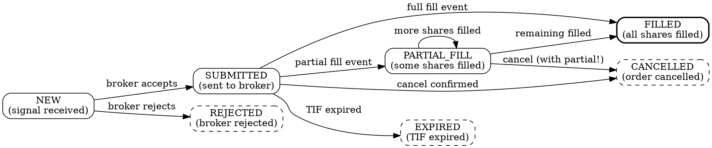

# Order Execution Integrity

## CRITICAL SKILL

This skill prevents the three most destructive bugs in automated trading:

- **Duplicate entries** -- entering the same position multiple times
- **Ghost positions** -- positions that exist at the broker but are untracked locally
- **Stop-loss slippage** -- stop-losses set on requested_qty instead of filled_qty

## The Iron Law

**TRACK `filled_qty` NOT `requested_qty`. EVERY ORDER HAS ONE LIFECYCLE. EVERY ENTRY PATH CHECKS UNIFIED DEDUP.**

Violate any of these and you will lose money. Not "might." Will.

---

## Unified Dedup Gate

There is ONE function. ALL entry paths call it. There is no alternative path, no
shortcut, no "this signal type doesn't need dedup."

### Why "Unified"?

The Emabot had 4 independent entry paths:
- EMA crossover signal
- Mean reversion signal
- Momentum breakout signal
- Manual override signal

Each had its own cooldown dictionary. Each checked only its own history. Result: SPY
was entered 11 times in one day. See the case study below.

### The Gate

```python
import time
import logging
from dataclasses import dataclass
from typing import Optional

logger = logging.getLogger(__name__)


@dataclass
class DedupResult:
    allowed: bool
    reason: Optional[str] = None


class UnifiedDedupGate:
    """ONE gate. ALL entry paths. NO exceptions.

    Every signal that wants to submit an order MUST pass through this gate.
    The gate checks ALL conditions and returns a clear allow/deny.
    """

    def __init__(self, db, cooldown_seconds: float = 300.0):
        self.db = db
        self.cooldown_seconds = cooldown_seconds

    async def check(
        self,
        symbol: str,
        side: str,
        signal_id: str,
        strategy_name: str,
    ) -> DedupResult:
        """Returns DedupResult. If not allowed, reason explains why.

        Checks performed (in order):
        1. Is this signal_id already processed?
        2. Do we already hold a position in this symbol?
        3. Is there a pending order for this symbol + side?
        4. Has the cooldown elapsed since last order for this symbol?

        ALL checks must pass. One failure = denied.
        """

        # Check 1: Signal already processed?
        if await self.db.signal_exists(signal_id):
            return DedupResult(
                allowed=False,
                reason=f"Signal {signal_id} already processed"
            )

        # Check 2: Already in position?
        position = await self.db.get_position(symbol)
        if position is not None:
            # If we're long and trying to buy, that's a duplicate
            # If we're long and trying to sell, that's an exit (allow it)
            if side == "buy" and position.side == "long":
                return DedupResult(
                    allowed=False,
                    reason=f"Already long {symbol} ({position.qty} shares)"
                )
            if side == "sell" and position.side == "short":
                return DedupResult(
                    allowed=False,
                    reason=f"Already short {symbol} ({position.qty} shares)"
                )

        # Check 3: Pending order exists?
        pending = await self.db.get_pending_orders(symbol, side)
        if pending:
            return DedupResult(
                allowed=False,
                reason=f"Pending {side} order for {symbol}: {pending[0].client_order_id}"
            )

        # Check 4: Cooldown elapsed?
        last_order_time = await self.db.get_last_order_time(symbol)
        if last_order_time is not None:
            elapsed = time.time() - last_order_time
            if elapsed < self.cooldown_seconds:
                remaining = self.cooldown_seconds - elapsed
                return DedupResult(
                    allowed=False,
                    reason=f"Cooldown active for {symbol}: {remaining:.0f}s remaining"
                )

        # All checks passed
        # IMMEDIATELY mark signal as processing to prevent race conditions
        await self.db.mark_signal_processing(signal_id, symbol, side, strategy_name)

        logger.info(
            f"DedupGate ALLOWED: {side} {symbol} "
            f"(signal={signal_id}, strategy={strategy_name})"
        )
        return DedupResult(allowed=True)


# Usage -- EVERY strategy calls the SAME gate
dedup_gate = UnifiedDedupGate(db=database, cooldown_seconds=300)

async def on_ema_signal(symbol, side, signal_id):
    result = await dedup_gate.check(symbol, side, signal_id, strategy_name="ema_cross")
    if not result.allowed:
        logger.info(f"EMA signal blocked: {result.reason}")
        return
    await submit_entry_order(symbol, side, signal_id)

async def on_momentum_signal(symbol, side, signal_id):
    result = await dedup_gate.check(symbol, side, signal_id, strategy_name="momentum")
    if not result.allowed:
        logger.info(f"Momentum signal blocked: {result.reason}")
        return
    await submit_entry_order(symbol, side, signal_id)

# Same for EVERY other strategy. Same gate. Same function. No shortcuts.
```

---

## Order State Machine

Every order follows exactly one lifecycle. No order can be in two states. No order can
skip a state (except going directly from NEW to REJECTED).

### State Diagram (DOT)



### State Machine Implementation

```python
from enum import Enum
from typing import Optional
from decimal import Decimal
from dataclasses import dataclass, field
import time


class OrderState(Enum):
    NEW = "new"
    SUBMITTED = "submitted"
    PARTIAL_FILL = "partial_fill"
    FILLED = "filled"
    CANCELLED = "cancelled"
    EXPIRED = "expired"
    REJECTED = "rejected"


# Valid transitions
VALID_TRANSITIONS = {
    OrderState.NEW: {OrderState.SUBMITTED, OrderState.REJECTED},
    OrderState.SUBMITTED: {
        OrderState.PARTIAL_FILL, OrderState.FILLED,
        OrderState.CANCELLED, OrderState.EXPIRED,
    },
    OrderState.PARTIAL_FILL: {
        OrderState.PARTIAL_FILL,  # more fills
        OrderState.FILLED,
        OrderState.CANCELLED,  # cancelled with partial fill!
    },
    # Terminal states -- no transitions out
    OrderState.FILLED: set(),
    OrderState.CANCELLED: set(),
    OrderState.EXPIRED: set(),
    OrderState.REJECTED: set(),
}

TERMINAL_STATES = {OrderState.FILLED, OrderState.CANCELLED, OrderState.EXPIRED, OrderState.REJECTED}


@dataclass
class OrderRecord:
    client_order_id: str
    broker_order_id: Optional[str]
    symbol: str
    side: str
    requested_qty: Decimal
    filled_qty: Decimal = Decimal("0")
    avg_fill_price: Optional[Decimal] = None
    state: OrderState = OrderState.NEW
    created_at: float = field(default_factory=time.time)
    updated_at: float = field(default_factory=time.time)
    state_history: list = field(default_factory=list)

    def transition(self, new_state: OrderState):
        """Transition to a new state. Raises on invalid transition."""
        if new_state not in VALID_TRANSITIONS.get(self.state, set()):
            raise ValueError(
                f"Invalid transition: {self.state.value} -> {new_state.value} "
                f"for order {self.client_order_id}"
            )
        old_state = self.state
        self.state = new_state
        self.updated_at = time.time()
        self.state_history.append({
            "from": old_state.value,
            "to": new_state.value,
            "at": self.updated_at,
        })

    @property
    def is_terminal(self) -> bool:
        return self.state in TERMINAL_STATES

    @property
    def unfilled_qty(self) -> Decimal:
        return self.requested_qty - self.filled_qty
```

---

## Partial Fill Tracking

**Track `filled_qty` from broker events. Position size = SUM(filled_qty). NEVER use requested_qty.**

```python
from decimal import Decimal
from typing import Optional
import logging

logger = logging.getLogger(__name__)


async def process_fill_event(
    db,
    client_order_id: str,
    cumulative_filled_qty: Decimal,
    avg_fill_price: Decimal,
    is_final: bool,
):
    """Process a fill or partial fill event from the broker.

    Args:
        cumulative_filled_qty: Total filled so far (from broker, cumulative).
        avg_fill_price: Average fill price across all fills.
        is_final: True if order is fully filled or terminal.
    """
    order = await db.get_order(client_order_id)
    if order is None:
        logger.error(f"Received fill for unknown order: {client_order_id}")
        await send_alert(f"UNKNOWN ORDER FILL: {client_order_id}")
        return

    # Compute incremental fill
    incremental_qty = cumulative_filled_qty - order.filled_qty
    if incremental_qty <= 0:
        logger.warning(f"Duplicate or stale fill event for {client_order_id}")
        return

    # Update order
    order.filled_qty = cumulative_filled_qty
    order.avg_fill_price = avg_fill_price

    if is_final:
        if cumulative_filled_qty >= order.requested_qty:
            order.transition(OrderState.FILLED)
        else:
            # Partial fill + cancel
            order.transition(OrderState.CANCELLED)
            logger.warning(
                f"Order {client_order_id} cancelled with partial fill: "
                f"{order.filled_qty}/{order.requested_qty}"
            )
    else:
        if order.state == OrderState.SUBMITTED:
            order.transition(OrderState.PARTIAL_FILL)

    await db.save_order(order)

    # Update position using ACTUAL filled_qty, NEVER requested_qty
    await update_position(
        db=db,
        symbol=order.symbol,
        side=order.side,
        filled_qty=order.filled_qty,  # <-- THE ACTUAL AMOUNT
        avg_price=avg_fill_price,
        client_order_id=client_order_id,
    )

    # Compute slippage
    expected_price = await db.get_expected_price(client_order_id)
    if expected_price and avg_fill_price:
        slippage = compute_slippage(avg_fill_price, expected_price)
        await db.record_slippage(client_order_id, slippage)
        if slippage > 0.005:  # 0.5% threshold
            await send_alert(
                f"HIGH SLIPPAGE: {order.symbol} {slippage:.2%} "
                f"(expected={expected_price}, filled={avg_fill_price})"
            )
```

---

## Slippage Monitoring

```python
from decimal import Decimal


def compute_slippage(fill_price: Decimal, expected_price: Decimal) -> float:
    """Compute slippage as a fraction.

    Returns: absolute slippage ratio (always >= 0).
    Example: expected=100, filled=100.50 -> slippage = 0.005 (0.5%)
    """
    if expected_price == 0:
        return 0.0
    return float(abs(fill_price - expected_price) / expected_price)


# Slippage thresholds
SLIPPAGE_WARN = 0.002   # 0.2% -- log warning
SLIPPAGE_ALERT = 0.005  # 0.5% -- send alert
SLIPPAGE_HALT = 0.02    # 2.0% -- halt trading, investigate


async def check_slippage(fill_price, expected_price, symbol, client_order_id):
    slippage = compute_slippage(fill_price, expected_price)

    if slippage >= SLIPPAGE_HALT:
        logger.error(f"CRITICAL SLIPPAGE {symbol}: {slippage:.2%} -- HALTING")
        await send_alert(f"CRITICAL SLIPPAGE: {symbol} {slippage:.2%}. Trading halted.")
        await halt_trading(reason=f"slippage_{symbol}_{slippage:.4f}")
    elif slippage >= SLIPPAGE_ALERT:
        logger.warning(f"High slippage {symbol}: {slippage:.2%}")
        await send_alert(f"High slippage: {symbol} {slippage:.2%}")
    elif slippage >= SLIPPAGE_WARN:
        logger.info(f"Slippage {symbol}: {slippage:.2%}")

    return slippage
```

---

## Cancel-Race Window

When you cancel an order, there is a window where the order might fill BEFORE the
cancellation takes effect. This is the "cancel-race window."

```
Timeline:
  T0: You send cancel request
  T1: Broker receives cancel
  T2: Exchange matches your order (FILL!)
  T3: Broker processes cancel (too late -- already filled)

Result: You think the order was cancelled, but you actually OWN the shares.
```

### Handling the Cancel-Race

```python
async def cancel_order_safely(db, broker, client_order_id: str):
    """Cancel an order and handle the race condition.

    After requesting cancellation, wait for the broker event to confirm.
    The broker will send either:
    - 'canceled' event (cancel succeeded)
    - 'fill' event (order filled before cancel arrived)
    - 'partial_fill' + 'canceled' (partial fill, then cancelled remainder)

    DO NOT assume the cancel succeeded until you receive the event.
    """
    order = await db.get_order(client_order_id)
    if order is None or order.is_terminal:
        return

    logger.info(f"Requesting cancel for {client_order_id}")

    try:
        await broker.cancel_order(order.broker_order_id)
    except Exception as e:
        # Cancel request failed -- order might still fill
        logger.error(f"Cancel request failed for {client_order_id}: {e}")

    # Mark as cancel-pending -- DO NOT assume cancelled
    await db.mark_cancel_pending(client_order_id)

    # The actual state transition happens when we receive the broker event
    # (in the trade_update handler). DO NOT transition here.
    logger.info(
        f"Cancel requested for {client_order_id}. "
        f"Waiting for broker confirmation event."
    )
```

---

## Case Study: The Emabot Duplicate Entry Disaster

### What Happened

The Emabot trading bot had four entry strategies:
1. **EMA Crossover** -- entered when fast EMA crossed above slow EMA
2. **Mean Reversion** -- entered when RSI was oversold
3. **Momentum Breakout** -- entered on volume surge + price breakout
4. **Manual Override** -- operator could force an entry via command

### The Bug

Each strategy had its OWN deduplication logic:

```python
# WRONG -- This is what Emabot did (simplified)

class EMACrossoverStrategy:
    def __init__(self):
        self.cooldown = {}  # Only tracks EMA cooldowns

    def should_enter(self, symbol):
        if symbol in self.cooldown:
            return False
        return True

class MeanReversionStrategy:
    def __init__(self):
        self.cooldown = {}  # Only tracks mean reversion cooldowns

    def should_enter(self, symbol):
        if symbol in self.cooldown:
            return False
        return True

# ... same pattern for momentum and manual
```

### The Disaster

On March 3, 2025, all four strategies generated buy signals for SPY within a
90-second window:

1. 09:31:12 -- EMA crossover fires, buys SPY (EMA cooldown set)
2. 09:31:30 -- Mean reversion fires, buys SPY (MR cooldown set, doesn't see EMA's)
3. 09:31:45 -- Momentum fires, buys SPY (Momentum cooldown set)
4. 09:32:01 -- Mean reversion fires AGAIN (RSI still oversold), buys SPY
5. ... this continued throughout the day

**Result: SPY was entered 11 times.** The bot was long 11x the intended position size.
When SPY dropped 0.8% that afternoon, the loss was 11x what it should have been.

### The Root Cause

No **unified** dedup gate. Each strategy only knew about its own orders. None of them
checked whether a position already existed at the broker level.

### The Fix

Replace all per-strategy dedup with the `UnifiedDedupGate` shown above. ONE function,
ALL paths, EVERY time.

```python
# CORRECT -- Single gate for all strategies
dedup_gate = UnifiedDedupGate(db=database, cooldown_seconds=300)

# EMA strategy
result = await dedup_gate.check(symbol, "buy", signal_id, "ema_cross")
if not result.allowed:
    return  # Blocked. Reason logged.

# Mean reversion strategy
result = await dedup_gate.check(symbol, "buy", signal_id, "mean_reversion")
if not result.allowed:
    return  # Blocked because EMA already entered.
```

### Lessons

1. **One gate to rule them all.** Never let strategies independently decide whether
   to enter.
2. **Check broker state, not just local state.** The position might exist at the
   broker even if your local dict doesn't know about it.
3. **Cooldowns are per-symbol, not per-strategy.** If SPY was entered by EMA, momentum
   should NOT also enter SPY.

---

## Red Flags -- Stop and Fix Immediately

| Red Flag | Why It's Dangerous |
|---|---|
| Multiple order submission functions | Each may bypass dedup or have inconsistent logic |
| Tracking `requested_qty` for position sizing | Partial fills mean actual position != requested |
| No slippage computation | You don't know if execution quality is degrading |
| No dedup check before order submission | Duplicate entries will eventually happen |
| Per-strategy cooldown dictionaries | Strategies don't know about each other's entries |
| No state machine for order lifecycle | Orders get "stuck" in intermediate states |
| Assuming cancel == cancelled | Cancel-race window means order might have filled |
| No fill event handler | Positions are tracked optimistically, not from actual fills |
| Position size from config, not from fills | After partial fill, actual size != configured size |

---

## Integration Points

- **trading-bot-skills:broker-api-integration** -- This skill defines WHAT to track; broker-api-integration defines HOW to communicate with the broker. Fill events flow from broker-api-integration into the handlers defined here.
- **trading-bot-skills:position-reconciliation** -- Even with perfect fill tracking, drift happens. Position reconciliation is the safety net that catches any discrepancy between local tracking and broker truth.
- **trading-bot-skills:risk-management-gates** -- Risk gates (max position size, max portfolio exposure, daily loss limits) should be checked AFTER dedup but BEFORE order submission.
- **trading-bot-skills:trading-code-reviewer** -- After implementing order execution changes, run the multi-agent review supervisor to verify order safety with dual-agent agreement before merging.
