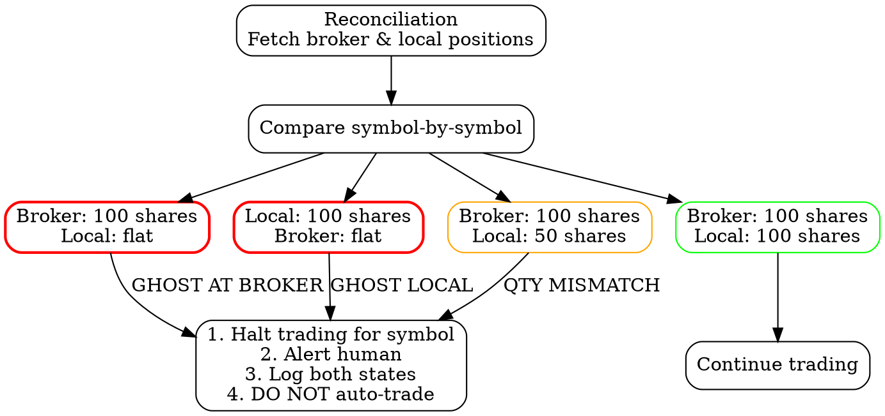

# Position Reconciliation

## CRITICAL SKILL

This skill prevents the two most catastrophic failure modes in automated trading:

- **Ghost positions** -- positions that exist at the broker but are invisible to the bot
- **Unmanaged positions after crash** -- the bot restarts and has no idea what it owns

## The Iron Law

**RECONCILIATION RUNS CONTINUOUSLY. BROKER STATE IS TRUTH. MISMATCHES HALT TRADING UNTIL RESOLVED.**

Not "reconcile at EOD." Not "reconcile when something seems wrong." CONTINUOUSLY.
Every 30 seconds. Because by the time you notice something is wrong, money is already
gone.

---

## Continuous Reconciliation Loop

```python
import asyncio
import logging
from dataclasses import dataclass
from decimal import Decimal
from typing import Optional

logger = logging.getLogger(__name__)


@dataclass
class PositionMismatch:
    symbol: str
    local_qty: Decimal
    broker_qty: Decimal
    local_side: Optional[str]
    broker_side: Optional[str]
    mismatch_type: str  # "ghost_at_broker", "ghost_local", "qty_mismatch", "side_mismatch"

    def __str__(self):
        return (
            f"MISMATCH [{self.mismatch_type}] {self.symbol}: "
            f"local={self.local_qty} ({self.local_side}), "
            f"broker={self.broker_qty} ({self.broker_side})"
        )


class PositionReconciler:
    """Continuous reconciliation between local state and broker.

    Runs every `interval_seconds`. On mismatch:
    1. Logs both states
    2. Sends alert
    3. Halts trading for affected symbols (or all symbols if critical)
    4. DOES NOT auto-correct by placing trades

    Human intervention required to resolve mismatches.
    """

    def __init__(
        self,
        db,
        broker,
        alert_service,
        trading_halt_manager,
        interval_seconds: float = 30.0,
        grace_period_seconds: float = 10.0,
    ):
        self.db = db
        self.broker = broker
        self.alert_service = alert_service
        self.trading_halt_manager = trading_halt_manager
        self.interval_seconds = interval_seconds
        self.grace_period_seconds = grace_period_seconds
        self._running = False
        self._consecutive_mismatches: dict[str, int] = {}

    async def run_loop(self):
        """Main reconciliation loop. Call this from your event loop."""
        self._running = True
        logger.info(
            f"Reconciliation loop started (interval={self.interval_seconds}s)"
        )
        while self._running:
            try:
                mismatches = await self.reconcile()
                if mismatches:
                    await self._handle_mismatches(mismatches)
                else:
                    # Clear consecutive mismatch counters on clean reconciliation
                    self._consecutive_mismatches.clear()
            except Exception as e:
                logger.error(f"Reconciliation error: {e}", exc_info=True)
                await self.alert_service.send(
                    f"RECONCILIATION ERROR: {e}. Manual check required."
                )
            await asyncio.sleep(self.interval_seconds)

    async def reconcile(self) -> list[PositionMismatch]:
        """Compare local positions with broker positions.

        Returns list of mismatches. Empty list = all good.
        """
        # Fetch both states
        broker_positions = await self.broker.get_positions()
        local_positions = await self.db.get_all_positions()

        # Build lookup dicts
        broker_map = {p.symbol: p for p in broker_positions}
        local_map = {p.symbol: p for p in local_positions}

        all_symbols = set(broker_map.keys()) | set(local_map.keys())
        mismatches = []

        # Get pending orders for grace period check
        pending_orders = await self.db.get_all_pending_orders()
        pending_symbols = {o.symbol for o in pending_orders}

        for symbol in all_symbols:
            broker_pos = broker_map.get(symbol)
            local_pos = local_map.get(symbol)

            # Skip symbols with pending orders (grace period)
            if symbol in pending_symbols:
                logger.debug(
                    f"Skipping {symbol} reconciliation -- pending order exists"
                )
                continue

            mismatch = self._compare_position(symbol, local_pos, broker_pos)
            if mismatch:
                mismatches.append(mismatch)

        return mismatches

    def _compare_position(
        self,
        symbol: str,
        local_pos,
        broker_pos,
    ) -> Optional[PositionMismatch]:
        """Compare a single symbol's position between local and broker."""

        local_qty = Decimal(str(local_pos.qty)) if local_pos else Decimal("0")
        broker_qty = Decimal(str(broker_pos.qty)) if broker_pos else Decimal("0")
        local_side = local_pos.side if local_pos else None
        broker_side = broker_pos.side if broker_pos else None

        # Case 1: Broker has position, local doesn't (GHOST AT BROKER)
        if broker_qty != 0 and local_qty == 0:
            return PositionMismatch(
                symbol=symbol,
                local_qty=local_qty,
                broker_qty=broker_qty,
                local_side=local_side,
                broker_side=broker_side,
                mismatch_type="ghost_at_broker",
            )

        # Case 2: Local has position, broker doesn't (GHOST LOCAL)
        if local_qty != 0 and broker_qty == 0:
            return PositionMismatch(
                symbol=symbol,
                local_qty=local_qty,
                broker_qty=broker_qty,
                local_side=local_side,
                broker_side=broker_side,
                mismatch_type="ghost_local",
            )

        # Case 3: Both have position but qty differs
        if local_qty != broker_qty:
            return PositionMismatch(
                symbol=symbol,
                local_qty=local_qty,
                broker_qty=broker_qty,
                local_side=local_side,
                broker_side=broker_side,
                mismatch_type="qty_mismatch",
            )

        # Case 4: Qty matches but side differs (should be impossible, but check)
        if local_side != broker_side and local_qty != 0:
            return PositionMismatch(
                symbol=symbol,
                local_qty=local_qty,
                broker_qty=broker_qty,
                local_side=local_side,
                broker_side=broker_side,
                mismatch_type="side_mismatch",
            )

        return None  # Positions match

    async def _handle_mismatches(self, mismatches: list[PositionMismatch]):
        """Handle detected mismatches. Alert + halt. NEVER auto-trade."""

        for m in mismatches:
            # Track consecutive mismatches per symbol
            self._consecutive_mismatches[m.symbol] = (
                self._consecutive_mismatches.get(m.symbol, 0) + 1
            )
            count = self._consecutive_mismatches[m.symbol]

            severity = "CRITICAL" if m.mismatch_type.startswith("ghost") else "WARNING"

            logger.error(f"POSITION {severity}: {m} (consecutive: {count})")

            # First occurrence might be timing; second confirms real mismatch
            if count >= 2:
                # Halt trading for this symbol
                await self.trading_halt_manager.halt_symbol(
                    m.symbol,
                    reason=f"Position mismatch: {m.mismatch_type}",
                )

                # Send alert
                await self.alert_service.send(
                    f"POSITION MISMATCH ({severity}): {m}\n"
                    f"Consecutive: {count}\n"
                    f"Trading HALTED for {m.symbol}.\n"
                    f"Manual intervention required."
                )

        # If we have ghost positions, consider halting ALL trading
        ghost_count = sum(
            1 for m in mismatches
            if m.mismatch_type.startswith("ghost")
            and self._consecutive_mismatches.get(m.symbol, 0) >= 2
        )
        if ghost_count >= 3:
            logger.error(
                f"CRITICAL: {ghost_count} ghost positions detected. "
                f"HALTING ALL TRADING."
            )
            await self.trading_halt_manager.halt_all(
                reason=f"{ghost_count} ghost positions detected"
            )
            await self.alert_service.send(
                f"CRITICAL: {ghost_count} ghost positions. ALL TRADING HALTED."
            )

    def stop(self):
        self._running = False
```

---

## Ghost Position Detection

A ghost position is one of the most dangerous states a trading bot can be in:

```
Ghost at Broker:
  Local state: FLAT (no position)
  Broker state: OWNS 100 shares of SPY
  Risk: Position is unmanaged. No stop-loss. No exit logic.
         If SPY drops 5%, you lose 5% on a position you don't even know about.

Ghost Local:
  Local state: OWNS 100 shares of SPY
  Broker state: FLAT (no position)
  Risk: Bot tries to manage a position that doesn't exist.
         Exit orders will fail or create new short positions.
         Stop-loss orders reference non-existent position.
```

### How Ghosts Are Created

```
Ghost at Broker (most common):
  1. Bot submits order
  2. Bot crashes before recording the fill
  3. Broker fills the order (broker doesn't care that your bot is down)
  4. Bot restarts -- no record of the fill
  5. Position exists at broker, invisible to bot
  => GHOST AT BROKER

Ghost Local (less common):
  1. Bot records a position
  2. Manual intervention closes the position at broker directly
  3. Bot doesn't know about the close
  4. Bot thinks it has a position; broker says flat
  => GHOST LOCAL
```

### Ghost Position State Diagram (DOT)



---

## Reconciliation Actions: What TO Do and What NOT TO Do

### DO

- Log the exact local state (qty, side, avg price, order history)
- Log the exact broker state (qty, side, avg price, cost basis)
- Send an immediate alert with both states
- Halt trading for the affected symbol
- If multiple ghosts, halt ALL trading
- Wait for human intervention

### DO NOT

- **Auto-correct by placing trades.** If local says flat and broker says 100 shares,
  DO NOT submit a sell order to "fix" it. You might be selling into a fast market, or
  the ghost might be from a legitimate pending order you haven't processed yet.
- **Silently update local state.** If you just overwrite local state with broker state,
  you lose the audit trail of how the mismatch happened.
- **Ignore it.** "It'll sort itself out" is how you get the Emabot crash scenario below.

```python
# WRONG -- never do this
async def auto_correct_ghost(broker, symbol, broker_qty):
    """DO NOT DO THIS."""
    await broker.submit_order(MarketOrderRequest(
        symbol=symbol,
        qty=broker_qty,
        side=OrderSide.SELL,
    ))
    # What if this was a legitimate position from a pending fill?
    # What if the sell creates a short position due to a race?
    # What if the market is in free-fall and you just market-sold into it?


# RIGHT -- alert and halt
async def handle_ghost_position(alert_service, halt_manager, mismatch):
    """Alert human. Halt symbol. Wait."""
    await halt_manager.halt_symbol(mismatch.symbol, reason=str(mismatch))
    await alert_service.send(
        f"GHOST POSITION DETECTED\n"
        f"Symbol: {mismatch.symbol}\n"
        f"Local: {mismatch.local_qty} ({mismatch.local_side})\n"
        f"Broker: {mismatch.broker_qty} ({mismatch.broker_side})\n"
        f"Type: {mismatch.mismatch_type}\n"
        f"ACTION REQUIRED: Manual review and resolution."
    )
```

---

## Startup Reconciliation

**On bot startup, ALWAYS reconcile BEFORE processing ANY signals.**

If there are mismatches at startup, DO NOT start trading. Period.

```python
async def startup_sequence(bot):
    """Bot startup sequence. Reconciliation is step 1."""

    logger.info("=" * 60)
    logger.info("BOT STARTUP SEQUENCE")
    logger.info("=" * 60)

    # Step 1: Connect to broker
    logger.info("Step 1: Connecting to broker...")
    await bot.broker.connect()

    # Step 2: RECONCILE BEFORE ANYTHING ELSE
    logger.info("Step 2: Startup reconciliation...")
    reconciler = bot.reconciler
    mismatches = await reconciler.reconcile()

    if mismatches:
        logger.error(f"STARTUP RECONCILIATION FAILED: {len(mismatches)} mismatches")
        for m in mismatches:
            logger.error(f"  {m}")

        await bot.alert_service.send(
            f"BOT STARTUP BLOCKED: {len(mismatches)} position mismatches.\n"
            + "\n".join(f"  - {m}" for m in mismatches)
            + "\nResolve mismatches before starting."
        )

        # DO NOT PROCEED
        raise StartupReconciliationError(
            f"Cannot start trading: {len(mismatches)} position mismatches. "
            f"Resolve manually before restarting."
        )

    logger.info("Step 2: Reconciliation PASSED -- positions match")

    # Step 3: Restore order state for any open/pending orders
    logger.info("Step 3: Restoring pending order state...")
    await bot.restore_pending_orders()

    # Step 4: Start signal processing
    logger.info("Step 4: Starting signal processor...")
    await bot.signal_processor.start()

    # Step 5: Start continuous reconciliation loop
    logger.info("Step 5: Starting continuous reconciliation...")
    asyncio.create_task(reconciler.run_loop())

    # Step 6: Start WebSocket streams
    logger.info("Step 6: Connecting WebSocket streams...")
    await bot.start_websockets()

    logger.info("=" * 60)
    logger.info("BOT STARTUP COMPLETE")
    logger.info("=" * 60)


class StartupReconciliationError(Exception):
    """Raised when startup reconciliation finds mismatches."""
    pass
```

---

## Grace Period for Pending Orders

When an order is pending (submitted but not yet filled), there will be a brief window
where the broker has filled shares but your local state hasn't processed the fill event
yet. This is NOT a mismatch -- it's normal latency.

```python
async def reconcile_with_grace(self) -> list[PositionMismatch]:
    """Reconcile with grace period for pending orders.

    If a symbol has a pending order that was submitted within the grace
    period, skip reconciliation for that symbol. The fill event should
    arrive shortly.
    """
    pending_orders = await self.db.get_all_pending_orders()
    now = time.time()

    grace_symbols = set()
    for order in pending_orders:
        if not order.is_terminal:
            time_since_submit = now - order.created_at
            if time_since_submit < self.grace_period_seconds:
                grace_symbols.add(order.symbol)
                logger.debug(
                    f"Grace period for {order.symbol}: "
                    f"pending order {order.client_order_id} "
                    f"({time_since_submit:.1f}s ago)"
                )

    # Run normal reconciliation but skip grace symbols
    all_mismatches = await self.reconcile()
    real_mismatches = [
        m for m in all_mismatches if m.symbol not in grace_symbols
    ]

    if len(all_mismatches) != len(real_mismatches):
        skipped = len(all_mismatches) - len(real_mismatches)
        logger.info(
            f"Reconciliation: {skipped} mismatches in grace period (ignored)"
        )

    return real_mismatches
```

**Important:** The grace period should be SHORT (5-15 seconds). If a pending order
hasn't filled after 30 seconds, something is genuinely wrong and reconciliation should
flag it.

---

## Case Study: The Emabot Crash -- 9 Unmanaged Positions

### What Happened

On a Monday morning, the Emabot was running with 9 active positions (SPY, QQQ, AAPL,
MSFT, AMZN, GOOGL, META, NVDA, TSLA). Each had stop-losses, exit targets, and
trailing stops managed by the bot.

At 9:19 AM ET, the bot crashed due to an unhandled exception in the signal processing
module.

### The Disaster

1. **9:19 AM** -- Bot crashes. 9 positions are now unmanaged.
2. **9:19 AM - 10:45 AM** -- No stop-losses are being monitored. No exit logic running.
   The operator didn't notice for 86 minutes.
3. **10:45 AM** -- Operator notices, restarts bot.
4. **10:45 AM** -- Bot starts up. It initializes a fresh in-memory state. Local
   positions: ZERO. Broker positions: 9.
5. **10:45 AM** -- Bot starts processing signals. It sees no local positions, so it
   starts entering NEW positions. Now some symbols have 2x the intended position.
6. **11:00 AM** -- Operator realizes there are duplicate positions. Manually closes
   everything. Total loss: ~$2,400 from unmanaged positions during the gap.

### Root Cause Analysis

The bot had NO startup reconciliation. When it restarted:

- It created a fresh empty state
- It never checked what the broker actually held
- It happily entered new positions on top of existing ones
- There was no mechanism to detect or alert on the mismatch

### What Should Have Happened

```
9:19 AM   -- Bot crashes
9:19 AM   -- Watchdog process detects crash, sends alert
9:20 AM   -- Watchdog attempts restart
9:20 AM   -- Bot starts startup_sequence()
9:20 AM   -- Step 2: Reconciliation finds 9 broker positions with 0 local records
9:20 AM   -- StartupReconciliationError raised
9:20 AM   -- Alert sent: "BOT STARTUP BLOCKED: 9 position mismatches"
9:20 AM   -- Bot DOES NOT start trading
9:25 AM   -- Operator sees alert, reviews positions
9:26 AM   -- Operator resolves: imports broker positions into local DB
9:27 AM   -- Operator restarts bot
9:27 AM   -- Reconciliation PASSES
9:27 AM   -- Bot resumes managing all 9 positions with stops intact
```

### Lessons

1. **Startup reconciliation is non-negotiable.** If your bot doesn't reconcile on
   startup, it will eventually restart into an inconsistent state. Not if. When.
2. **Continuous reconciliation is the safety net.** Even if you miss a fill event,
   the 30-second reconciliation loop catches it before damage compounds.
3. **A watchdog process must monitor the bot.** If the bot crashes and nobody knows for
   86 minutes, that's an infrastructure failure.
4. **Position state must survive restarts.** Use a database, not in-memory dicts. When
   the bot restarts, it must be able to read its previous state.
5. **When in doubt, HALT.** A bot that halts on mismatch loses nothing. A bot that
   trades through a mismatch loses money.

---

## Position State Storage

**Never store position state only in memory.** Use a database.

```python
from dataclasses import dataclass
from decimal import Decimal
from typing import Optional
import time


@dataclass
class PersistedPosition:
    symbol: str
    qty: Decimal
    side: str  # "long" or "short"
    avg_entry_price: Decimal
    entry_time: float
    last_reconciled_at: float
    stop_loss_price: Optional[Decimal] = None
    take_profit_price: Optional[Decimal] = None

    # Metadata for debugging
    entry_order_id: Optional[str] = None
    entry_strategy: Optional[str] = None


# Database schema (SQLite example)
CREATE_POSITIONS_TABLE = """
CREATE TABLE IF NOT EXISTS positions (
    symbol TEXT PRIMARY KEY,
    qty REAL NOT NULL,
    side TEXT NOT NULL,
    avg_entry_price REAL NOT NULL,
    entry_time REAL NOT NULL,
    last_reconciled_at REAL NOT NULL,
    stop_loss_price REAL,
    take_profit_price REAL,
    entry_order_id TEXT,
    entry_strategy TEXT,
    updated_at REAL NOT NULL
);
"""

# Every reconciliation updates last_reconciled_at.
# If last_reconciled_at is more than 2 minutes old, something is wrong
# with the reconciliation loop.
```

---

## Red Flags -- Stop and Fix Immediately

| Red Flag | Why It's Dangerous |
|---|---|
| Reconciliation only at EOD | 6.5 hours of potential drift during market hours |
| Auto-correcting by placing trades | Can create new positions, sell into crashes, cause cascading errors |
| No startup reconciliation | Bot restarts into inconsistent state, enters duplicate positions |
| Position state stored in memory only | Crash = total state loss = ghost positions everywhere |
| Position state in multiple places | Dict here, list there, DB somewhere else -- they WILL diverge |
| No grace period for pending orders | Every pending order triggers false mismatch alerts |
| Reconciliation errors silently caught | `except: pass` on reconciliation = you have no safety net |
| No alerts on mismatch | Mismatch happens, nobody knows, losses accumulate |
| Assuming broker API always works | Broker returns empty positions during outage = false ghost detection |

---

## Integration Points

- **trading-bot-skills:order-execution-integrity** -- Fill tracking feeds position state. If fill tracking is broken, reconciliation catches the drift. These two skills are complementary layers of defense.
- **trading-bot-skills:trading-monitoring-and-alerts** -- Reconciliation mismatches must trigger alerts. Without a working alert system, mismatches go unnoticed.
- **trading-bot-skills:kill-switch-and-circuit-breakers** -- When reconciliation detects critical mismatches (multiple ghosts), it should trigger the kill switch to flatten all positions and halt trading.
