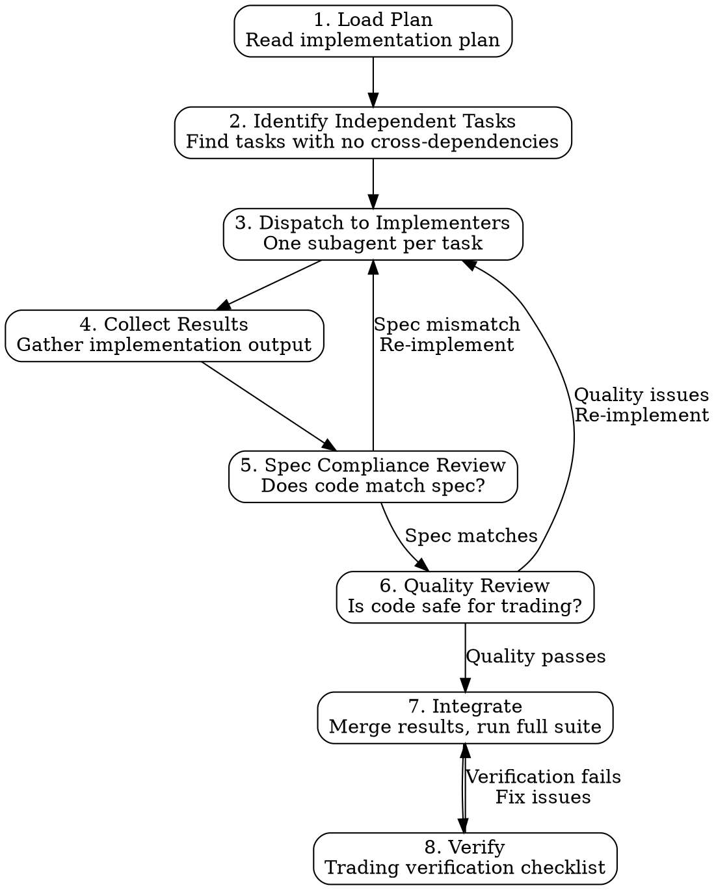

# Subagent-Driven Development

## Purpose

This skill enables parallel execution of implementation plan tasks by dispatching them to specialized subagent roles: implementers who write code and reviewers who verify quality. This accelerates development while maintaining quality through structured review.

## When to Use

- You have a reviewed implementation plan (from `writing-plans` skill).
- The plan contains independent tasks that can be parallelized.
- You want structured quality assurance with separate implementation and review.

## Process Flow



## Step-by-Step Process

### Step 1: Load the Plan

Read the implementation plan. Identify:
- Total number of tasks.
- Dependencies between tasks.
- Which tasks can run in parallel.
- Which tasks must be sequential.

### Step 2: Identify Independent Tasks

Tasks are independent if:
- They modify different files.
- They do not depend on each other's output.
- They can be tested in isolation.

Build a dependency graph:
```
Task 1 (config) -----> Task 3 (feature using config)
Task 2 (utility) ----> Task 4 (feature using utility)
                   \-> Task 5 (feature using utility)
Task 6 (independent integration test)
```

In this example: Tasks 1, 2, and 6 can run in parallel. Tasks 3, 4, 5 must wait for their dependencies.

### Step 3: Dispatch to Implementer Subagents

For each task (or batch of independent tasks), dispatch an implementer subagent using the template in `implementer-prompt.md`.

**Context to provide each implementer:**
- The specific task from the plan (exact text).
- Relevant existing code that the task builds on or modifies.
- The design document (or relevant sections).
- Trading-specific rules (see below).

### Step 4: Collect Results

Gather the output from each implementer:
- Code changes (files created or modified).
- Test results (did the implementer's tests pass?).
- Any issues or questions encountered.

### Step 5: Spec Compliance Review

Send the implementation to the spec compliance reviewer (`spec-reviewer-prompt.md`). The reviewer verifies:
- Implementation matches the spec exactly.
- No over-building (features not in the spec).
- No under-building (spec requirements missing from implementation).
- Test coverage matches spec requirements.

If spec mismatch is found, re-dispatch to the implementer with specific feedback.

### Step 6: Code Quality Review

Send the spec-compliant implementation to the code quality reviewer (`code-quality-reviewer-prompt.md`). The reviewer checks:
- Trading-specific safety (fail-closed, done_callbacks, dedup, freshness).
- Code style and clarity.
- Test quality (not just coverage, but meaningful assertions).
- No hardcoded values that should be config.
- No magic numbers.

If quality issues are found, re-dispatch to the implementer with specific feedback.

### Step 7: Integrate

After all tasks pass both reviews:
1. Merge all changes into the working branch.
2. Run the full test suite to check for integration issues.
3. Resolve any conflicts or integration failures.

### Step 8: Verify

Run the full trading verification checklist (from `verification-before-completion` skill):
- All 10 trading-tdd categories passing.
- No fail-open patterns.
- All order paths through dedup.
- All async tasks have done_callbacks.
- All config validated.
- All data freshness checks in place.

---

## Model Selection Guidance

Choose the subagent model based on task complexity:

| Task Type | Recommended Model | Rationale |
|-----------|------------------|-----------|
| Simple utility function | Fast/efficient model | Straightforward, well-defined |
| Complex algorithm | Capable model | Needs reasoning about edge cases |
| Risk/safety critical code | Most capable model | Trading safety requires deep analysis |
| Test writing | Capable model | Tests need to cover edge cases |
| Integration work | Most capable model | Needs broad system understanding |
| Config/boilerplate | Fast/efficient model | Mechanical, pattern-following |

---

## Implementer Status Handling

When an implementer subagent returns, classify the result:

| Status | Action |
|--------|--------|
| **SUCCESS** | Proceed to spec review |
| **PARTIAL** | Review what was completed. Re-dispatch remaining work. |
| **BLOCKED** | Investigate the blocker. May need to resolve a dependency first. |
| **FAILED** | Review error output. Fix the issue or revise the task. |
| **QUESTIONS** | Answer questions. Re-dispatch with additional context. |

---

## Trading-Specific Implementer Context

Every implementer subagent MUST receive these trading-specific rules as part of their context. These are non-negotiable requirements for all trading bot code.

### Rule 1: Fail-Closed Requirement

Every function that handles errors in risk, validation, or decision-making code MUST be fail-closed:
- Exception -> return explicit REJECT (not None, not pass-through).
- None from dependency -> treat as REJECT.
- Timeout -> treat as REJECT.

```python
# CORRECT: fail-closed
def check_risk(order):
    try:
        result = self._evaluate_risk(order)
        if result is None:
            return RiskResult(approved=False, reason="Risk check returned None")
        return result
    except Exception as e:
        logger.error(f"Risk check exception: {e}")
        return RiskResult(approved=False, reason=f"Risk check error: {e}")

# WRONG: fail-open
def check_risk(order):
    try:
        return self._evaluate_risk(order)
    except Exception:
        return None  # BUG: caller may treat None as "no objection"
```

### Rule 2: Done Callback Requirement

Every async task MUST have a `done_callback` that:
- Logs task completion or failure.
- Alerts on unexpected failure.
- Updates the task registry.

```python
# CORRECT
task = asyncio.create_task(self._process_signals())
task.add_done_callback(self._on_task_complete)

def _on_task_complete(self, task):
    if task.cancelled():
        logger.warning(f"Task {task.get_name()} was cancelled")
    elif task.exception():
        logger.error(f"Task {task.get_name()} failed: {task.exception()}")
        alert_operator(f"TASK FAILURE: {task.get_name()}")
    else:
        logger.info(f"Task {task.get_name()} completed successfully")

# WRONG
task = asyncio.create_task(self._process_signals())
# No done_callback -- task can fail silently
```

### Rule 3: Unified Dedup Gate Requirement

Every code path that can result in an order submission MUST go through the single unified dedup gate. No exceptions. No "fast paths." No "this one is different."

```python
# CORRECT: all order paths through the gate
async def on_signal(self, signal):
    if not self.dedup_gate.check(signal):
        logger.info(f"Signal deduped: {signal}")
        return None
    if not self.risk_manager.check(signal):
        logger.info(f"Signal rejected by risk: {signal}")
        return None
    if self.kill_switch.is_active:
        logger.info(f"Signal rejected: kill switch active")
        return None
    return await self.order_manager.submit(signal)

# WRONG: bypassing dedup
async def emergency_close(self, symbol):
    # "Emergency" does not justify bypassing dedup
    return await self.order_manager.submit(close_signal)  # BUG: no dedup check
```

---

## Parallelization Strategy

### Safe to Parallelize

- Tasks modifying different files with no shared state.
- Tests for independent components.
- Config additions that do not depend on each other.
- Utility functions with no cross-dependencies.

### Must Be Sequential

- Tasks where one creates a module that another imports.
- Tasks where one defines an interface that another implements.
- Integration tests that depend on unit-tested components.
- Config validation that depends on the config schema existing.

### Execution Order Template

```
Batch 1 (parallel):  Task 1 (config), Task 2 (utility A), Task 3 (utility B)
                     [Wait for all to complete and pass review]
Batch 2 (parallel):  Task 4 (feature using config), Task 5 (feature using utility A)
                     [Wait for all to complete and pass review]
Batch 3 (sequential): Task 6 (integration using Tasks 4+5)
                     [Wait for completion and review]
Batch 4:             Full verification
```

---

## Red Flags -- Stop and Reassess

- **Dispatching tasks without a reviewed plan**: Use the `writing-plans` skill first.
- **Skipping spec review**: Implementation must match spec. No exceptions.
- **Skipping quality review for trading code**: Safety checks are not optional.
- **Parallel tasks that share mutable state**: These must be sequential or you will get race conditions.
- **Implementer returns without running tests**: Tests must pass before review. Re-dispatch.
- **"It's just a small change, skip review"**: Small changes in trading systems can have large consequences. Review everything.
- **Merging without full test suite run**: Integration issues only surface when all code is together. Run the full suite.
