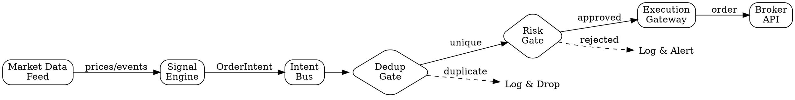

# Trading Bot Architecture

Prevents the "emabot class" of failures: duplicate entries from 4 independent
code paths, complexity explosion from tangled responsibilities, and the
impossibility of reasoning about system behavior when everything touches
everything.

---

## The Iron Law

> **NO DIRECT BROKER CALLS FROM STRATEGY CODE. EVER.**
>
> Strategy code emits *intents*. Infrastructure code executes *orders*.
> The boundary between them is the Intent Bus. Cross it, and you create
> a second order path that bypasses dedup, risk gates, and audit logging.
>
> Origin: The emabot incident. Four independent code paths could submit
> orders to the broker. Each had its own cooldown dict, its own retry
> logic, its own error handling. A rapid signal burst hit all four paths
> simultaneously, producing 4x intended position size. Total exposure
> exceeded risk limits by 300%. The fix was not "better cooldowns" -- it
> was eliminating 3 of the 4 paths entirely.

---

## Event-Driven Architecture

Every trading bot MUST follow this pipeline. No shortcuts. No "just this once."



### Pipeline Components

| Component          | Responsibility                                      | Owns State?     |
|--------------------|-----------------------------------------------------|-----------------|
| Market Data Feed   | Receive and normalize price data                    | No (stateless)  |
| Signal Engine      | Evaluate strategies, emit intents                   | Signal state only|
| Intent Bus         | Route intents to gates, ensure ordering             | Message queue   |
| Dedup Gate         | Reject duplicate intents by idempotency key         | Dedup cache     |
| Risk Gate          | Enforce position limits, exposure caps, circuit breakers | Risk state  |
| Execution Gateway  | Translate intents to broker orders, handle fills    | Order state     |
| Broker API         | Transport layer to exchange/broker                  | None (external) |

---

## Single Entry Point Rule

> **ALL order intents MUST flow through ONE gateway.**
>
> Not two gateways. Not "one for market orders and one for limits."
> Not "one for the main strategy and one for the hedging strategy."
> ONE.

```python
# BAD: Multiple entry points
class MainStrategy:
    async def on_signal(self, signal):
        await self.broker.place_order(signal.symbol, signal.qty)  # Path 1

class HedgeStrategy:
    async def on_signal(self, signal):
        await self.broker.submit(signal.symbol, -signal.qty)  # Path 2

class RiskManager:
    async def flatten(self):
        await self.broker.close_all()  # Path 3

# GOOD: Single entry point
class MainStrategy:
    async def on_signal(self, signal):
        await self.intent_bus.emit(OrderIntent(
            source="main_strategy",
            symbol=signal.symbol,
            qty=signal.qty,
            idempotency_key=f"main-{signal.id}",
        ))

class HedgeStrategy:
    async def on_signal(self, signal):
        await self.intent_bus.emit(OrderIntent(
            source="hedge_strategy",
            symbol=signal.symbol,
            qty=-signal.qty,
            idempotency_key=f"hedge-{signal.id}",
        ))

class RiskManager:
    async def flatten(self):
        await self.intent_bus.emit(FlattenIntent(
            source="risk_manager",
            reason="risk_limit_breach",
            idempotency_key=f"flatten-{uuid4()}",
        ))
```

---

## State Ownership

> **Position state is owned by ONE component. Period.**
>
> If two components both track "current position," they WILL diverge.
> When they diverge, one will make decisions based on stale data.
> In trading, stale position data means wrong sizing, wrong exposure,
> wrong risk calculations.

### State Ownership Map

| State                    | Owner                  | Others Access Via          |
|--------------------------|------------------------|----------------------------|
| Current positions        | Position Manager       | `position_manager.get(symbol)` |
| Open orders              | Execution Gateway      | `gateway.open_orders(symbol)` |
| Risk limits              | Risk Gate              | `risk_gate.limits_for(symbol)` |
| Strategy signals         | Signal Engine          | Events on Intent Bus       |
| Market data (latest)     | Market Data Feed       | `feed.latest(symbol)`      |
| Dedup history            | Dedup Gate             | Internal only              |
| P&L                      | Position Manager       | `position_manager.pnl()`  |

### Anti-Pattern: Distributed Position Tracking

```python
# BAD: Multiple components tracking position
class Strategy:
    def __init__(self):
        self.positions = {}  # Strategy's view of positions

    async def on_fill(self, fill):
        self.positions[fill.symbol] += fill.qty  # Diverges from truth!

class RiskManager:
    def __init__(self):
        self.positions = {}  # Risk manager's view of positions

    async def on_fill(self, fill):
        self.positions[fill.symbol] += fill.qty  # Different divergence!

# GOOD: Single owner, others query
class PositionManager:
    """THE source of truth for positions."""
    def __init__(self):
        self._positions: dict[str, Decimal] = {}

    async def apply_fill(self, fill: Fill) -> Position:
        self._positions[fill.symbol] = (
            self._positions.get(fill.symbol, Decimal("0")) + fill.qty
        )
        return self.get(fill.symbol)

    def get(self, symbol: str) -> Position:
        return Position(symbol=symbol, qty=self._positions.get(symbol, Decimal("0")))

class Strategy:
    """Queries PositionManager, never tracks its own."""
    def __init__(self, position_manager: PositionManager):
        self.pm = position_manager

    async def on_signal(self, signal):
        current = self.pm.get(signal.symbol)
        # Make decision based on authoritative position data
```

---

## Component Boundaries

Each component MUST:

1. **Have a single responsibility** -- it does one thing
2. **Own its state** -- or query another component's state, never both
3. **Communicate via the Intent Bus** -- never by direct method calls across boundaries
4. **Be independently testable** -- mock the bus, test the component
5. **Have a clean shutdown** -- cancel tasks, flush state, release resources

### Boundary Enforcement

```python
# Every component inherits from a base that enforces the contract
from abc import ABC, abstractmethod

class TradingComponent(ABC):
    """Base class enforcing component boundaries."""

    def __init__(self, bus: IntentBus):
        self._bus = bus
        self._tasks: set[asyncio.Task] = set()

    @abstractmethod
    async def start(self) -> None:
        """Initialize and begin processing. Called after all components registered."""
        ...

    @abstractmethod
    async def stop(self) -> None:
        """Graceful shutdown. Cancel tasks, flush state."""
        ...

    def _create_task(self, coro, *, name: str) -> asyncio.Task:
        """Create a tracked task with done_callback."""
        task = asyncio.create_task(coro, name=name)
        self._tasks.add(task)
        task.add_done_callback(self._tasks.discard)
        task.add_done_callback(self._on_task_done)
        return task

    def _on_task_done(self, task: asyncio.Task) -> None:
        if not task.cancelled() and task.exception():
            logger.error(f"Task {task.get_name()} failed: {task.exception()}")
            # Propagate to monitoring -- see async-reliability skill
```

---

## Startup and Shutdown Protocol

### Startup: Reconcile with Broker FIRST

> Before the bot processes ANY signals, it MUST reconcile its local state
> with the broker's state. Stale state from the previous session will
> cause incorrect position sizing and risk calculations.

```python
async def startup_sequence(bot: TradingBot) -> None:
    """Correct startup order. Do not rearrange."""

    # 1. Connect to broker (no trading yet)
    await bot.broker.connect()

    # 2. RECONCILE: Sync positions with broker
    broker_positions = await bot.broker.get_positions()
    local_positions = await bot.position_manager.get_all()
    await bot.reconciler.reconcile(broker_positions, local_positions)

    # 3. RECONCILE: Sync open orders with broker
    broker_orders = await bot.broker.get_open_orders()
    local_orders = await bot.execution_gateway.get_open_orders()
    await bot.reconciler.reconcile_orders(broker_orders, local_orders)

    # 4. Load risk limits (after positions are accurate)
    await bot.risk_gate.load_limits()

    # 5. Start market data feed
    await bot.market_data.connect()

    # 6. Start signal engine LAST (only after everything else is ready)
    await bot.signal_engine.start()

    logger.info("Bot startup complete. All systems reconciled and active.")
```

### Shutdown: Stop Signals FIRST

```python
async def shutdown_sequence(bot: TradingBot) -> None:
    """Correct shutdown order. Reverse of startup."""

    # 1. Stop generating new signals FIRST
    await bot.signal_engine.stop()

    # 2. Drain the intent bus (process remaining intents)
    await bot.intent_bus.drain(timeout=10.0)

    # 3. Wait for pending orders to settle
    await bot.execution_gateway.wait_for_pending(timeout=30.0)

    # 4. Disconnect market data
    await bot.market_data.disconnect()

    # 5. Final reconciliation before disconnect
    await bot.reconciler.final_check()

    # 6. Disconnect from broker LAST
    await bot.broker.disconnect()

    logger.info("Bot shutdown complete. All systems clean.")
```

---

## Red Flags

| Red Flag                                          | Why It's Dangerous                                              | Correct Pattern                              |
|---------------------------------------------------|-----------------------------------------------------------------|----------------------------------------------|
| Strategy code importing broker client             | Creates direct order path bypassing all safety gates            | Strategy imports IntentBus, emits intents    |
| Multiple `place_order` or `submit_order` functions| Multiple entry points = multiple paths = impossible to audit    | ONE ExecutionGateway.execute() method        |
| Shared cooldown/throttle dicts across strategies  | Strategies become coupled; one's cooldown affects another's     | Per-strategy state, centralized risk gate    |
| Position tracked in multiple components           | State diverges; decisions made on stale data                    | Single PositionManager, others query it      |
| No reconciliation on startup                      | Bot operates on yesterday's state; position size is wrong       | Always reconcile with broker before trading  |
| Signal engine starts before reconciliation        | Generates orders based on stale positions                       | Signal engine starts LAST in startup         |
| Direct asyncio.create_task without tracking       | Orphaned tasks that fail silently                               | Use component._create_task with done_callback|
| God class with 500+ lines                         | Tangled responsibilities, impossible to test or reason about    | Split by responsibility, one component each  |
| Configuration mixed with logic                    | Can't change params without touching execution code             | Separate config layer, injected at startup   |

---

## Testing Architecture Compliance

```python
import ast
import pathlib

def test_no_direct_broker_imports_in_strategies():
    """Verify the iron law: no broker imports in strategy code."""
    strategy_dir = pathlib.Path("src/strategies/")
    violations = []

    for py_file in strategy_dir.rglob("*.py"):
        tree = ast.parse(py_file.read_text())
        for node in ast.walk(tree):
            if isinstance(node, ast.ImportFrom):
                if node.module and "broker" in node.module.lower():
                    violations.append(f"{py_file}:{node.lineno}: imports {node.module}")

    assert violations == [], (
        f"Strategy code must not import broker modules directly.\n"
        f"Violations:\n" + "\n".join(violations)
    )


def test_single_execution_gateway():
    """Verify only one class can submit orders to the broker."""
    src_dir = pathlib.Path("src/")
    order_submitters = []

    for py_file in src_dir.rglob("*.py"):
        content = py_file.read_text()
        if "broker.place_order" in content or "broker.submit" in content:
            order_submitters.append(str(py_file))

    assert len(order_submitters) <= 1, (
        f"Multiple files submit orders to broker (should be exactly 1):\n"
        + "\n".join(order_submitters)
    )
```

---

## Complex Event Processing and Protocol Adapters

### CEP Engine Pattern

The signal engine IS a CEP engine -- it processes streams of market events to detect patterns. Rather than ad-hoc if/else chains, formalize pattern detection with windowed event rules:

```python
@dataclass(frozen=True)
class EventRule:
    name: str
    window_seconds: float
    min_events: int
    condition: Callable[[list[MarketEvent]], bool]

class CEPEngine:
    def __init__(self, rules: list[EventRule]):
        self.rules = rules
        self.event_buffer: dict[str, deque] = defaultdict(deque)

    async def process_event(self, event: MarketEvent) -> list[Signal]:
        self.event_buffer[event.symbol].append(event)
        self._prune_expired(event.symbol)
        signals = []
        for rule in self.rules:
            events_in_window = self._get_window(event.symbol, rule.window_seconds)
            if len(events_in_window) >= rule.min_events and rule.condition(events_in_window):
                signals.append(Signal(source=rule.name, symbol=event.symbol))
        return signals
```

Each rule declares its time window, minimum event count, and a condition function. The engine buffers events per symbol, prunes expired entries, and evaluates all rules on every incoming event. This keeps pattern detection centralized and testable -- add a new rule without touching existing logic.

### Broker Adapter Layer

Abstract adapter for multi-broker support. Each broker (Alpaca, IBKR, Tradier) implements the same interface. The registry provides lookup by name, making broker selection a configuration decision rather than a code change.

```python
class BrokerAdapter(Protocol):
    async def submit_order(self, order: Order) -> OrderResult: ...
    async def cancel_order(self, order_id: str) -> CancelResult: ...
    async def get_positions(self) -> list[Position]: ...
    async def get_account(self) -> AccountInfo: ...
    async def subscribe_fills(self, callback: Callable) -> None: ...

class BrokerAdapterRegistry:
    _adapters: dict[str, BrokerAdapter] = {}

    def register(self, name: str, adapter: BrokerAdapter):
        self._adapters[name] = adapter

    def get(self, name: str) -> BrokerAdapter:
        if name not in self._adapters:
            raise BrokerNotConfigured(f"No adapter for broker: {name}")
        return self._adapters[name]
```

### FIX Protocol

FIX (Financial Information eXchange) replaces REST/WebSocket in the execution gateway for institutional brokers. Key considerations:

- **Session management**: FIX sessions are stateful with sequence numbers. A dropped session requires gap-fill or resend requests.
- **Heartbeat**: both sides send heartbeats at agreed intervals. Missing heartbeats trigger test requests and eventually session disconnects.
- **Sequence numbers**: every message has a sequence number. Gaps indicate missed messages and trigger resend logic.
- **When to use it**: most retail bots will NOT need FIX. REST/WebSocket via Alpaca or Tradier is sufficient. FIX becomes relevant for institutional brokers, DMA (Direct Market Access), or when sub-millisecond execution matters.
- **Adapter pattern**: because FIX is just another transport, the `BrokerAdapter` protocol makes it pluggable. Implement `FIXBrokerAdapter` that translates `Order` objects to FIX messages internally.

### Red Flags

| Red Flag | Why It's Dangerous |
|---|---|
| CEP rules scattered across files | Impossible to see all active rules; conflicting rules go undetected |
| Broker-specific code in strategy logic | Strategy becomes untestable and locked to one broker |
| No adapter abstraction | Switching brokers requires rewriting strategy and risk code |
| FIX session mixed with order logic | Session recovery bugs cause order duplication or loss |

See `cep-adapter-reference.md` in this directory for a complete CEP engine implementation, example broker adapters, and registry initialization patterns.

---

## When to Scale Beyond Single-Process

This skill covers **single-process, local event-driven architecture** — which handles 80% of trading bot use cases. When you outgrow single-process, see the companion skill:

- **More than 5 strategies** running simultaneously
- **More than 50 symbols** tracked in real-time
- **Latency requirements below 10ms** end-to-end
- **Multi-asset, multi-broker** operation
- **Team of 3+ developers** needing independent deployment

If any of these apply, see `distributed-trading-patterns` for Kafka/NATS event streaming, actor models, microservices decomposition, and distributed kill-switch patterns.

## Integration

| Scenario                                  | Invoke Skill                           |
|-------------------------------------------|----------------------------------------|
| Implementing the execution gateway        | `order-execution-integrity`            |
| Implementing the risk gate                | `risk-management-gates`                |
| Implementing the dedup gate               | `order-execution-integrity`            |
| Setting up async task management          | `async-reliability`                    |
| Designing the database schema             | `database-safety-for-trading`          |
| Testing the architecture                  | `trading-tdd`                          |
| Adding market data handling               | `market-data-integrity`               |
| Deploying the bot                         | `deployment-and-rollback`              |
| Scaling beyond single-process             | `distributed-trading-patterns`         |
| Integrating broker via MCP                | `mcp-broker-integration`              |

---

## References

See `event-driven-reference.md` in this directory for a complete reference
implementation showing the full event-driven architecture with typed events,
message bus, and component boundaries.
